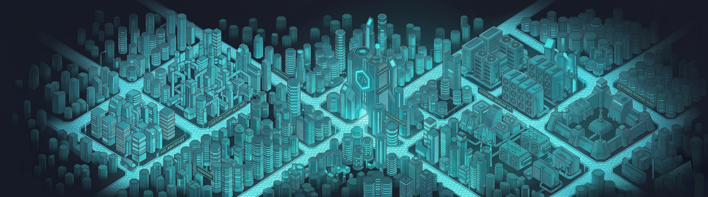

<p align="center">
	
</p>

<h1 align="center">HexaJS</h1>

<p align="center">
	Build browser extensions like real applications.
</p>

<p align="center">
	<a href="https://hexajs.dev">Website</a>
	·
	<a href="https://hexajs.dev/docs/getting-started">Docs</a>
	·
	<a href="https://github.com/hexajs-dev/hexajs/issues">Issues</a>
</p>

<p align="center">
	
</p>

HexaJS is a TypeScript-first framework for building browser extensions as real applications — with structured architecture, a full AOT build pipeline, and a first-class developer experience across all major browsers.

---

## What Makes HexaJS Different

| | |
|---|---|
| 🧩 **Structured architecture** | Controller/handler/service model with context-aware DI across background, content, and UI |
| 🔀 **Browser-agnostic** | Typed messaging and a ports layer eliminate browser-specific glue code |
| ⚡ **AOT-first build** | Discovers routes, validates context boundaries, and generates bootstraps before runtime |
| 🗃️ **State management** | Reducer/effect/store model for background and content contexts with RxJS selectors |
| 🎨 **Managed UI** | Popup, devtools, and newtab with React or Vue 3 — built and hot-reloaded by Hexa |
| 🔥 **Real HMR** | Live updates across UI, content, and background without losing extension state |

---

## Platform Support

- ✅ **Manifest V3** — fully supported across Chrome, Firefox, Edge, Brave, Opera, and Safari
- ❌ **Manifest V2** — not supported

---

## UI Modes

Hexa builds managed UI surfaces (popup, devtools, newtab) using its internal Vite pipeline. Choose your framework project-wide via `ui.framework`:

```json
{ "ui": { "framework": "react" } }
{ "ui": { "framework": "vue" } }
```

| Mode | Description |
|---|---|
| `"managed"` | Hexa builds and HMR-reloads your source. Supports **React** and **Vue 3**. |
| `"external"` | Use your own build pipeline. Hexa copies built assets into the extension. |
| `"none"` | Surface disabled. |

Content `@View` shadow overlays follow the same project-wide `ui.framework` choice.

---

## Core Capabilities

**Background**
- `@Controller` + `@Action` — typed unicast request/response endpoints
- `@On` — fire-and-forget multicast events
- `HexaBackgroundStore` — context-owned state with reducers, effects, and `initState`
- `@Worker` — isolated CPU/DOM workers with streaming progress events

**Content**
- `@Handler` + `@Handle` — receive typed messages from background
- `@Subscribe` — listen to multicast broadcasts
- `HexaContentStore` — per-page state store with the same reducer/effect model
- `@View` — inject React or Vue components into shadow DOM overlays

**General**
- Ports (`@hexajs-dev/ports`) — platform-normalized wrappers for every browser API
- Dependency injection — context-scoped, AOT-validated, lifecycle-aware
- Tokens — injectable config values with per-environment and per-platform overrides
- Validation pipes — AOT-generated DTO validators on every routed message boundary

---

## HMR That Matters

| Context | Chrome | Firefox | Safari |
|---|---|---|---|
| UI | ✅ Full HMR | ✅ Full HMR | ✅ Full HMR |
| Content | ✅ Full HMR | ✅ Full HMR | ✅ Full HMR |
| Background | ⚡ Debug patch | ✅ Full HMR | 🔄 Reload fallback |

See the full behavior table in [HMR docs](https://hexajs.dev/docs/cli-tooling/hmr).

---

## Quick Start

```bash
npm install -g @hexajs-dev/cli
hexa new my-extension
cd my-extension
pnpm install
hexa build --platform chrome
```

Development with watch mode:

```bash
hexa build --platform chrome --mode development --watch
```

---

## Documentation

| Section | Description |
|---|---|
| [Getting Started](https://hexajs.dev/docs/getting-started) | Installation, first steps, scaffold |
| [Core Fundamentals](https://hexajs.dev/docs/core-fundamentals) | DI, controllers, handlers, tokens, workers, validation |
| [State Management](https://hexajs.dev/docs/state-management) | Store, actions, reducers, effects, RxJS selectors |
| [Managed UI](https://hexajs.dev/docs/managed-ui) | Popup, devtools, newtab, React & Vue integration, shadow views |
| [Browser-Agnostic Messaging](https://hexajs.dev/docs/browser-agnostic-messaging) | Ports, bridged routing, custom ports |
| [CLI & Tooling](https://hexajs.dev/docs/cli-tooling) | Build output, pipeline, manifest patching, HMR |
| [Advanced Techniques](https://hexajs.dev/docs/advanced-techniques) | Cross-context state sync, worker streaming, typed contracts, environment config |
| [API Reference](https://hexajs.dev/docs/api-reference) | All ports — background, content, UI, general |

---

## Examples

Full source at **[github.com/hexajs-dev/examples](https://github.com/hexajs-dev/examples)**

| Example | Framework | Platforms | Highlights |
|---|---|---|---|
| [hexa-grayscale](https://github.com/hexajs-dev/examples/tree/main/hexa-grayscale) | React | Chrome · Firefox · Safari · Edge | Minimal starter — content script, background controller, managed popup |
| [hexa-grayscale-vue](https://github.com/hexajs-dev/examples/tree/main/hexa-grayscale-vue) | Vue 3 | Chrome · Firefox · Safari · Edge · Opera · Brave | Same as above with `ui.framework: "vue"` |
| [clip-volt](https://github.com/hexajs-dev/examples/tree/main/clip-volt) | React | Chrome · Firefox · Safari · Edge · Opera · Brave | Clipboard manager — cross-context state sync, content store + effects, shadow overlay, devtools panel |
| [smart-clipper](https://github.com/hexajs-dev/examples/tree/main/smart-clipper) | React | Chrome · Firefox · Safari · Edge · Opera · Brave | Screen capture + OCR — DOM worker, streaming progress events, validated DTO contracts, devtools diagnostics |

---

## Report Policy

Please use the structured templates so reports are reproducible, actionable, and easy to triage.

- 🐛 [New bug report](https://github.com/hexajs-dev/hexajs/issues/new?template=bug_report.yml)
- 💡 [New feature suggestion](https://github.com/hexajs-dev/hexajs/issues/new?template=feature_suggestion.yml)

---

## License

MIT — see [LICENSE.md](LICENSE.md).
